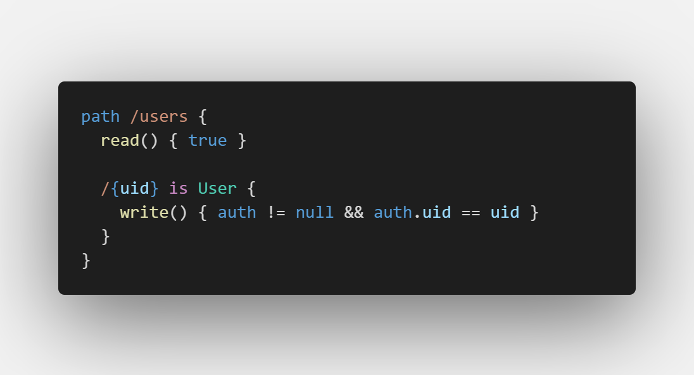

# vscode-bolt

**⚠️ This extension has been merged into [vscode-bolt-language](https://github.com/smkamranqadri/vscode-bolt-language) ⚠️**

VS Code language support extension for Firebase [Bolt](https://github.com/FirebaseExtended/bolt)

## Features
  - Syntax highlighting for Firebase Bolt files

## Setup

### Local Install
  - Copy repo folder into `<user home>/.vscode/extensions`
  - Restart VS Code
